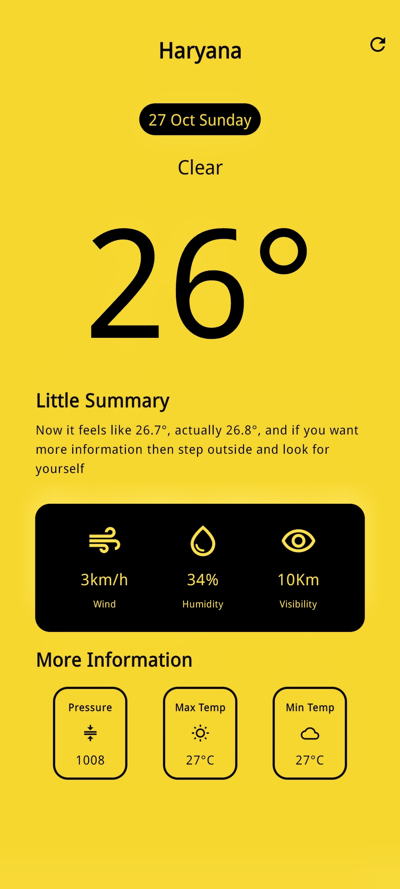

# Weather App ☀️🌧️

This Weather App is built using **Kotlin** and **Jetpack Compose**, utilizing the OpenWeather API to fetch and display current weather conditions, temperature, and additional meteorological data. 



## Features Checklist 📋

- [x] Display current weather conditions and temperature
- [ ] Background changes dynamically based on the weather
- [ ] Change location to view weather in different areas
- [ ] Request and use user’s live location
- [ ] Additional page for extended weather information
- [ ] Hourly weather information displayed
- [ ] Splash screen on app launch


## Getting Started 🚀

Follow these instructions to get a copy of the project running on your local machine for development and testing purposes.

### Prerequisites

- **Android Studio** (latest version recommended)
- **API Key** from [OpenWeather](https://openweathermap.org/)

### Installation

1. **Clone the Repository:**
   ```bash
   git clone https://github.com/A-man404/Weather-App.git
   cd Weather-App

### Releases
You can download the latest version of the app from the [Release v1.0.0](https://github.com/A-man404/Weather-App/releases/tag/v1.0.0).
